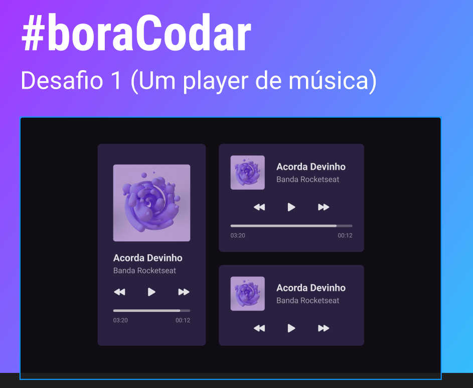

<h1 align="center"> Desafio 1 BoraCodar </h1>

##  Tecnologias

Esse projeto foi desenvolvido com as seguintes tecnologias:

- HTML e CSS
- Git e Github
- Figma
- JavaScript
- Phosphoricon

##  Layout

Você pode visualizar o layout do projeto através [DESSE LINK](https://www.figma.com/file/nZkD9ecgds49AQHcUOtC6P/%23boraCodar---Desafio-1-(Community)?type=design&node-id=1-133&mode=design&t=dwGTMNIpZxdegd5o-0). 

 

  

## Sobre
os icones do phosphoricon substituíram as imagens fornecidas pelo projeto figma 